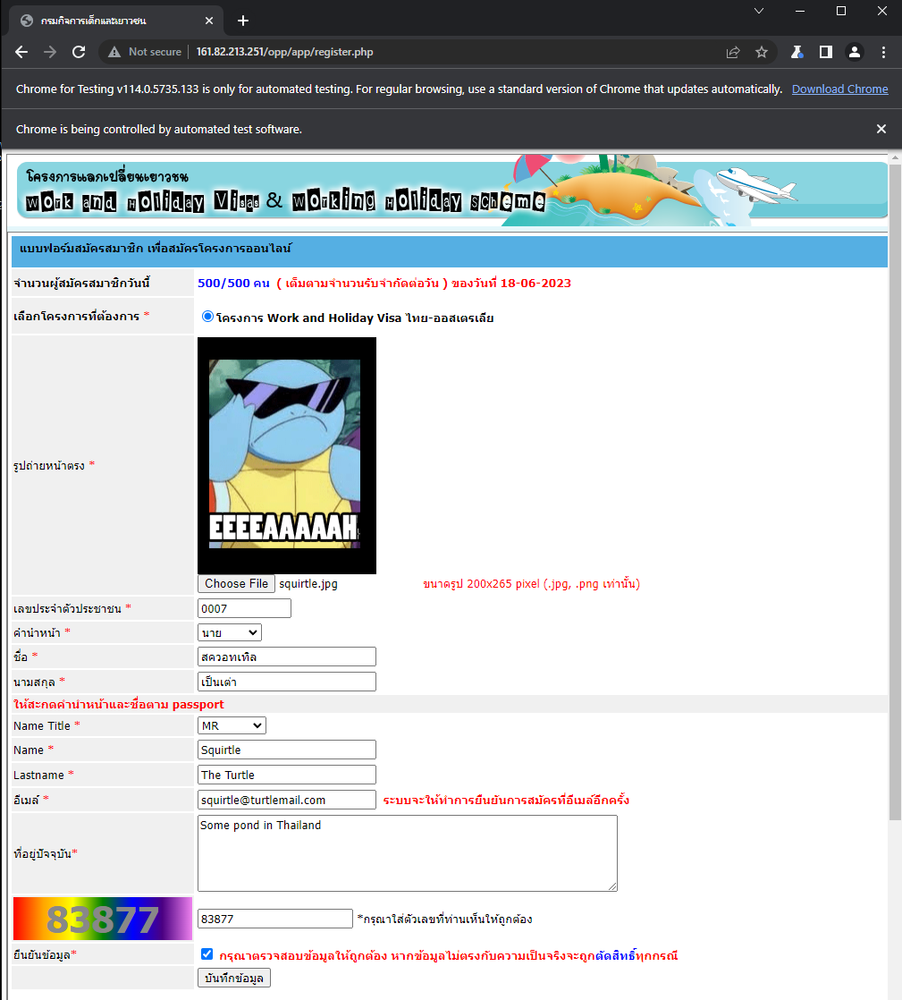

# WAH Robot

## Prerequisites
Make sure you have installed the following prerequisite on your machine
* Node.js - [Download & Install Node.js](https://nodejs.org/en/download/) - this require to setup the script to be run

## Install
Run the following command on your favourite shell to install the application dependency
```bash
npm install
```

## Setup Robot
Create the json file with the required properties. Please check on the [sample file](./src/profile.sample.json)

```json
{
    "imagePath": "R:/path/to/image/squirtle.jpg",
    "id": "0007",
    "prefixTh": "นาย",
    "nameTh": "สควอทเทิล",
    "lastnameTh": "เป็นเต่า",
    "prefixEn": "MR",
    "nameEn": "Squirtle",
    "lastnameEn": "The Turtle",
    "email": "squirtle@turtlemail.com",
    "address": "Some pond in Thailand",
    "x": "0", // x position of the browser
    "y": "0", // y position of the browser
    "width": "1024", // width of the browser
    "height": "720" // height of the browser
}
```

For browser properties, the application allow you to specify the position and size of the browser when running the application in order to support you to run multiple process at once :)

## Running Your Robot
Run the following command - replace the path to json file that provide your profile which created  from **Setup Robot** section

```bash
npm run start -- "R:/path/to/profile/profile.json"
```

The robot will keep in waiting state until 8.59AM. Then it will start to load the register page.

The robot will automatically reload the register page if there's any connection problem or the form is not yet ready. Then it will fill and submit the form. If the submission request is failed, the browser will retry itself for a while. However, if it keep failed til timeout, you need to refresh the page to resubmit the form yourself.

## Run Your Robot (without submit)

To check the input information - you could run the robot in test mode by the following command.

```bash
npm run start -- "R:/path/to/profile/profile.json" true
```

The robot will only fill the form as show in the following image.



If you need to submit the form, you could click the button yourself.


# WAH Autofill Console Script

In case you are not familiar with Nodejs application, you could just manually run the script over the browser console instead.

* Copy the script from [./scripts/console-autofill.js](./scripts/console-autofill.js)
* Modify your personal information in `run()` function
* Run the script in Console on any browser's developer tools

For `imageBase64`, you could get yours by convert your image to base64 string with this site - https://www.base64-image.de/

# Credits

Squirtle the 🐢
